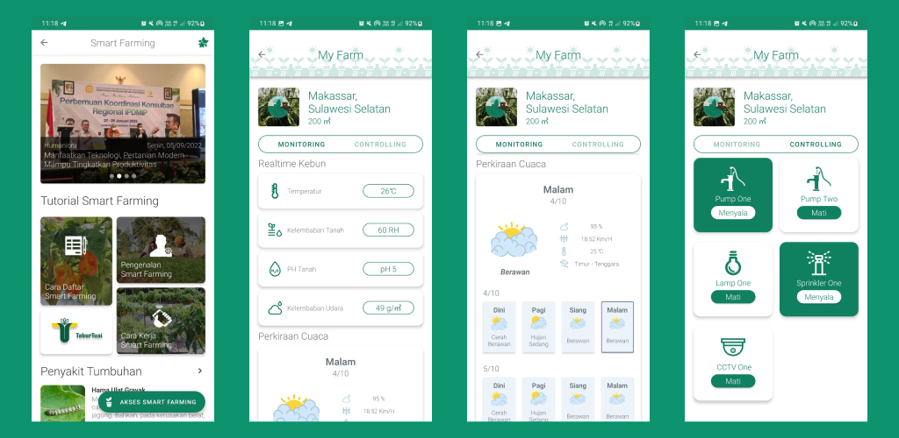

# TaburTuai Android App

TaburTuai is a startup aiming to bring smart farming to local farmers in South Sulawesi. Our Android app helps farmers manage their farms remotely using IoT technology. With this app, farmers can control devices and check the temperature and humidity right from their phones. Additionally, they can access weather forecasts and other data from BMKG (Badan Meteorologi, Klimatologi, dan Geofisika) to plan their farming activities effectively.

## Features

- **Remote Control**: Easily switch devices on and off from anywhere, making farm management a breeze.
- **Live Monitoring**: Get real-time updates on important farm conditions like humidity and temperature.
- **BMKG Integration**: Access weather forecasts and other data from BMKG to plan farming activities effectively.
- **Community Discussion (In Development)**: Soon, farmers will be able to share tips, ask questions, and discuss farming techniques with each other right in the app.
- **Simple Setup**: Just clone the repository, configure Firebase, and you're good to go.
- **Easy to Contribute**: Want to help make the app better? Fork the repo, add your feature, and send a pull request.

## Screenshots

## Get it on Google Play

## Contact

Got questions or need support? Email us at [taburtuaigroup@gmail.com](mailto:taburtuaigroup@gmail.com).
